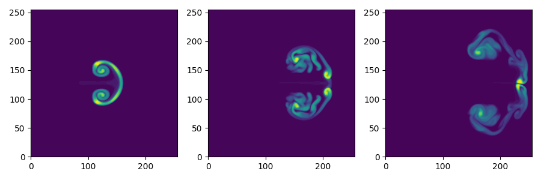
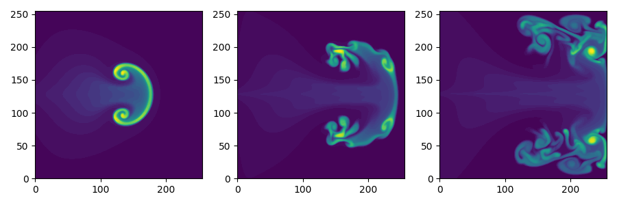
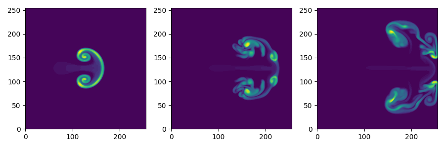
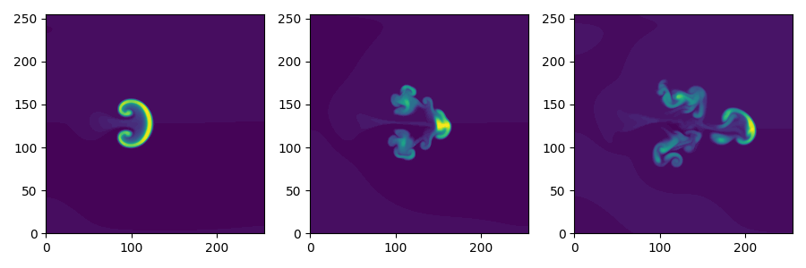
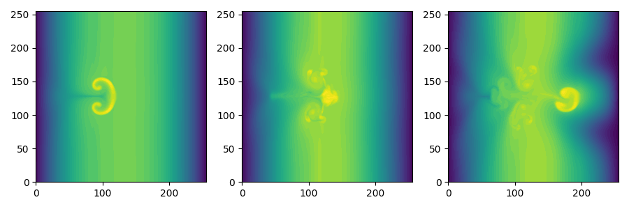

# Plasma-fluid-equations
Work surrounding plasma fluid equations.

Attempt to work out the initial time-evolution of a blob in the limit of small diamagnetic drift (NB not same limit as examples run so far).  The author acknowledges significant help from Dr John Omotani of UKAEA.

The plasma fluid equations for the simplest Hermes-3 example, called blob2d, are, in the plane (here $e=1$)

$$
\dot{n} - \frac{1}{B} \left ( \frac{\partial \phi}{\partial x} \frac{\partial n}{\partial y} - \frac{\partial \phi}{\partial y} \frac{\partial n}{\partial x} \right ) = \frac{n \phi}{L};\\
\dot{\omega} - \frac{1}{B} \left ( \frac{\partial \phi}{\partial x} \frac{\partial \omega}{\partial y} - \frac{\partial \phi}{\partial y} \frac{\partial \omega}{\partial x} \right ) = \epsilon  \frac{\partial n}{\partial y} + \frac{n \phi}{L};\\
\nabla^2 \phi = B^2 \omega.
$$

Expanding about a circularly-symmetric initial solution $n_0$ using $n=n_0 + \epsilon n_1$, $\omega = \epsilon \omega_1$, $\phi = \epsilon \phi_1$ one has, where all quantities are the first order ones (subscript dropped) except $n_0$, and the prime is radial derivative,

```math
\dot{n} + \frac{n_0'}{Br} \frac{\partial \phi}{\partial \varphi} = \frac{n_0 \phi}{L};
\dot{\omega} = n_0' \sin \varphi + \frac{n_0 \phi}{L};
\nabla^2 \phi = B^2 \omega.
```

Now inspecting the departure from the initial condition, take all quantities to be Taylor series in time $t$

```math
n = n^{(1)} t + n^{(2)} t^2;
\omega = \omega^{(1)} t + \omega^{(2)} t^2;
\phi = \phi^{(1)} t + \phi^{(2)} t^2.
```
One sees immediately $n^{(1)} = 0$ and the initial time evolution of $n^{(2)}$ can be determined by solving

```math
\omega^{(1)} = n_0' \sin \varphi;\\
\nabla^2 \phi^{(1)} = B^2 n_0' \sin \varphi;
n^{(2)} = \frac{1}{2} \left ( \frac{n_0 \phi^{(1)}}{L} - \frac{n_0'}{Br} \frac{\partial \phi^{(1)}}{\partial \varphi} \right ).
```

One can work this out for plausible circularly-symmetric blob initial states (now dropping the superscripts, and assuming $\phi \propto \sin \varphi$).  The main step is evaluation of the potential from the Poisson equation

```math
\phi''+\frac{1}{r} \phi' - \frac{1}{r^2} \phi = B^2 n_0'.
```

Note that the complementary function solutions are not promising, being multiples of $\frac{1}{r}$ and $r$, but the reciprocal one can be added to cancel poles in the particular integral terms.

There follow some analytic results for some plausible blob initial conditions.

1. Gaussian blob $n_0 = e^{-\frac{r^2}{2 r_0^2}}$

A particular integral of the Poisson equation is

```math
\phi = \frac{r_0^2 B^2 e^{-\frac{r^2}{2 r_0^2}}}{r}
```

The pole at $r=0$ can be dealt with by adding a multiple of the $\frac{1}{r}$ piece of the complementary function to give

```math
\phi = \frac{r_0^2 B^2 (e^{-\frac{r^2}{2 r_0^2}}-1)}{r}
```

2. Lorentzian blob $n_0 = \frac{1}{1+\frac{r^2}{r_0^2}}$

The potential solves to (again, cancelling any pole with a multiple of $\frac{1}{r}$)

```math
\phi = - \frac{r_0^2 B^2 \ln(1+\frac{r^2}{r_0^2})}{2 r}
```

3. Poeschl-Teller blob $n_0 = \mathrm{sech}^2 \left ( \frac{r}{r_0} \right )$

The potential is

$$
\phi = r_0 B^2 \left ( \frac{r_0 \ln \cosh \left ( \frac{r}{r_0} \right )}{r} - \tanh \left ( \frac{r}{r_0} \right )\right )
$$

The quadratic term $n = n^{(2)}t^2$ is easily computed from these using the formula from above $n^{(2)} = \frac{1}{2} \left ( \frac{n_0 \phi^{(1)}}{L} - \frac{n_0'}{Br} \frac{\partial \phi^{(1)}}{\partial \varphi} \right )$.  In each case there is a term $\propto \sin \varphi$ and a term $\propto \cos \varphi$.

There follow some plots showing the density evolution.  Note the plots are **not** in the small diamagnetic drift limit and they show the nonlinear evolution of the state.  All based on the blob2d example in Hermes-3 with the only mod being the initial data.  All scale lengths are $r_0=0.05$ and the domain is the unit square (as in original Hermes-3 example).

**Gaussian initial condition output**



Note this is different to the Hermes-3 documentation's Gaussian as the background density is zero here.

**Lorentzian initial condition output**



**Poeschl-Teller initial condition output**



**Effect of anomalous diffusion**

The Hermes-3 example ran as-is:



Turning on anomalous diffusion for the electron density and using anomalous_D=2 give the following.  Note what appears to be boundary effect, probably caused by the fact that the blob evolves in a constant background density of 1 and not zero as in my above examples (was this done to make the simulation execute faster - as my examples are an order of magnitude slower to run).


